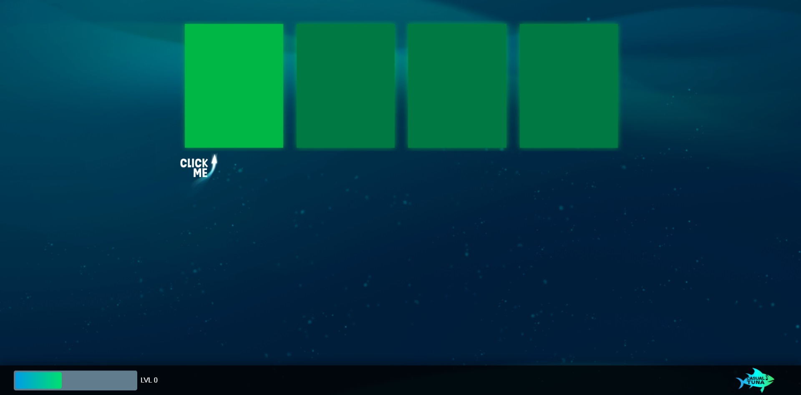
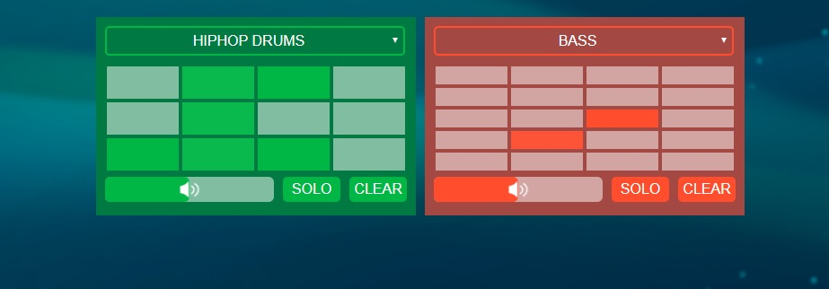
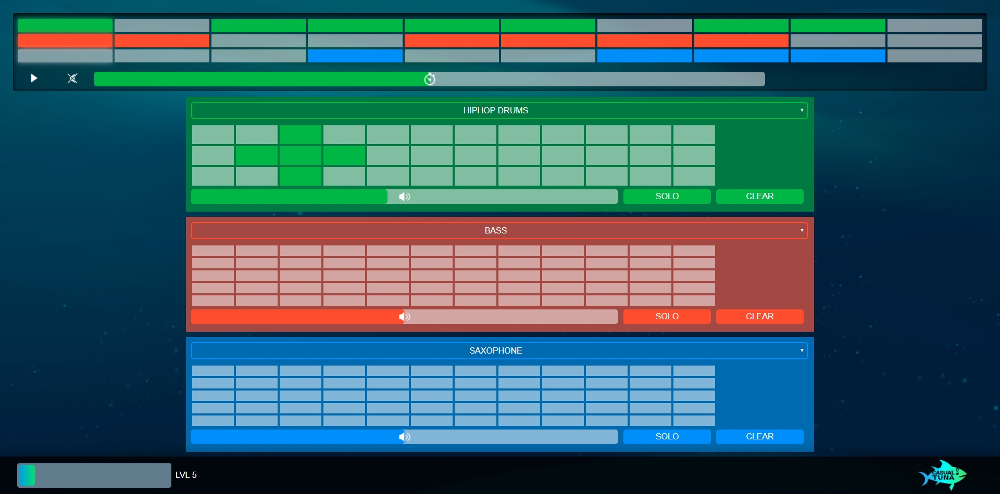
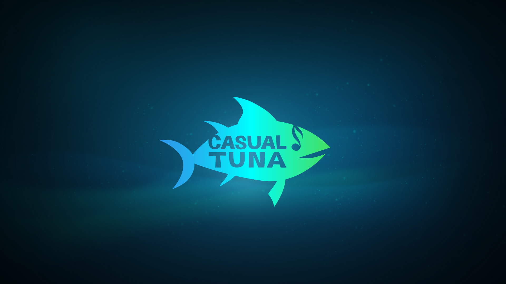

<html>
    <body>
        

            <h2>Casual Tuna</h2>
            

                Casual Tuna was a game project and part of the <a href="https://www.igjam.eu/jams/igjam-11-feat-hamburger-fern-hochschule/">InnoGamesJam #11</a>. 
                  
                The motivation for this project was to enable inexperienced users, and users who were unfamiliar with the music terminology, to compose and create their very own music. 
                 
                Meant as an introduction to the composing scene, this web application introduces the player to the first essentials of most music software, while doing so in a playful manner.
                This was achieved by simplifying the interface and creating a level system, which gradually unlocked more tools as the time passed on.
                  
                My roles where Game Designer, Project Manager as well as Scrum Master for the duration of the Jam. I designed the level system as well as the user experience, while staying in touch with every member of the team. Consequently I was responsible for combining and finalizing all ideas as well as the creative input from every member.
                 
                <a href="https://0x0ade.github.io/casual-tuna/">Link to the website.</a>
            

            

                
                
                
            

             
            

                
            

        

    </body>
</html>