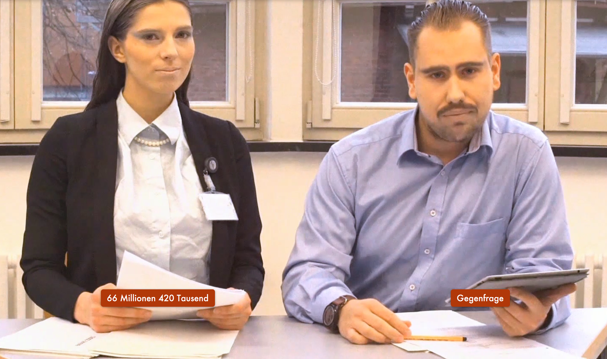

<html>
    <body>
        

            <h2>MediTech</h2>
            

                MediTech was an award-winning Life-Action-Game including multiple stages, as well as a public closing event.  
                The first stage was the setup stage in which participants where “recruited” via hints across the city, as well as through a custom made website.  
                During the second stage the players had to solve multiple puzzles in order to become eligible to participate in the final event. Lastly for the third stage all participants who successfully solved the puzzles were invited to the Live-Action-Game. 
                Although it was possible for each player to come up with different solutions for the puzzles. Depending on their answers they would then get affiliated with one out of four starting characters. 
                During the live event, the participants could choose which further actions to take and therefore change the outcome of the game.
                  
                My position for this thirty-man project was Writer, Project Designer, Game Designer as well being part of the Project Managing Group. I designed the story and general layout of the events as well as defining the setting.
                  
                The project also won the "Karl H. Ditze Prize" for best project 2017. 
                <a href="assets/images/DitzePreis.pdf">Link to the Certificate</a>
            

             
            

                
                
                
            

        

    </body>
</html>