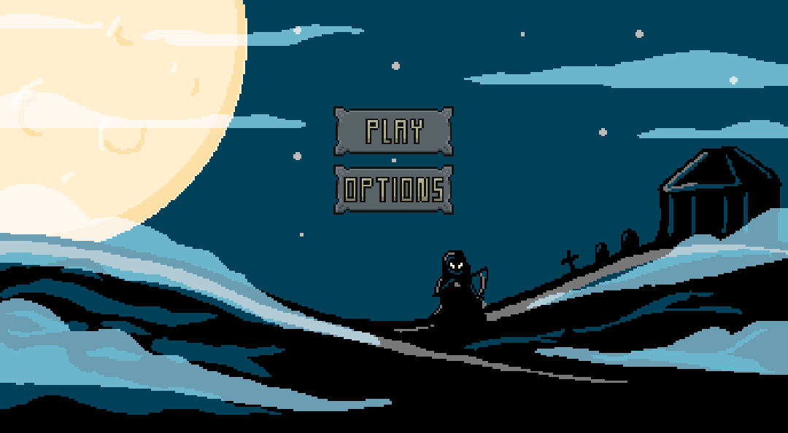
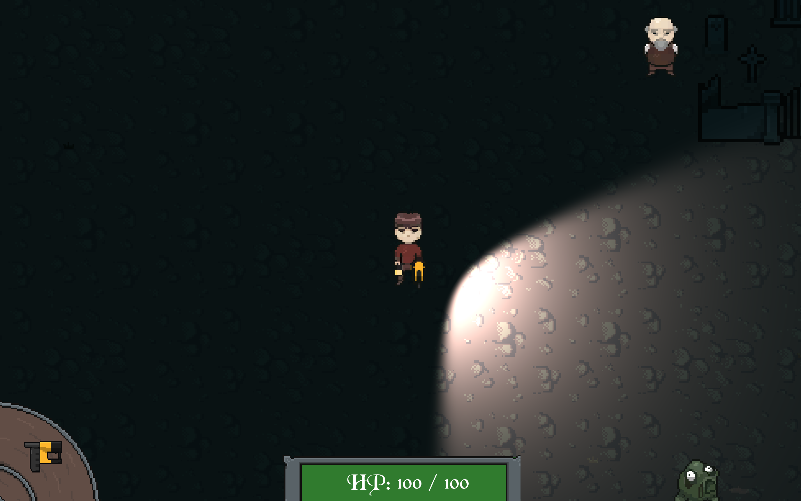
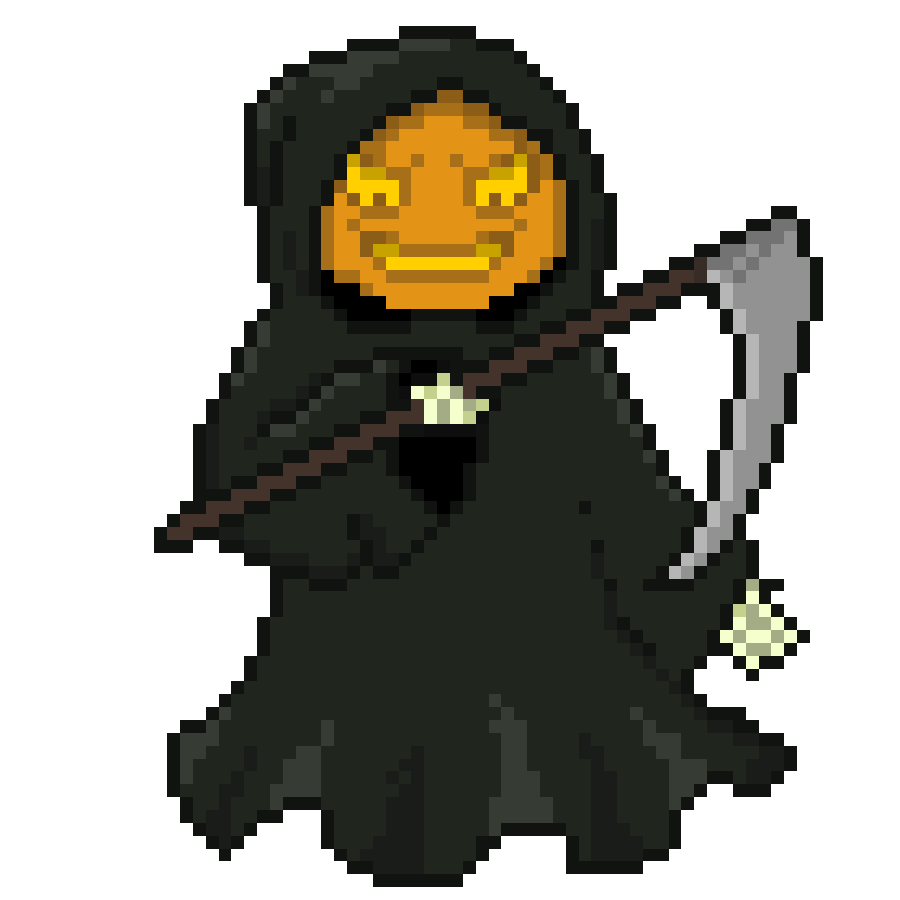

<html>
    <body>
        

            <h2>Veiled Night</h2>
            

                Veiled Night was a game project and part of the <a href="https://www.igjam.eu/jams/igjam-12/">InnoGamesJam #12</a>. 
                  
                Theme for this particular Jam was “Spooktacular” in spirit of Halloween, which at the time was just around the corner.
                 
                The story resolves around a young boy on his quest to avenge his mother by fighting against the minions of evil. He must defeat all bosses and collect their trophies to be able to summon the final boss, the Reaper.
                  
                Based on the general interest for roguelike games in our group, this projects purpose was to tie together theme and flavors into a single bundle of entertainment. Unfortunately on the technical end of things it didn’t quite work out as intended, but still plenty of experiences where gained and all together it was a fun project to work on.
                  
                My responsibilities where Game Design, Project Management, Scrum Master, as well as developing the story, gameplay and defining the overall flavor.
                 
                <a href="https://hearthis.at/vault-kid-hm/set/veiled-night-ost-igjam12/">Link to some of the music</a>.
            

            

                
                
                
            

        

    </body>
</html>