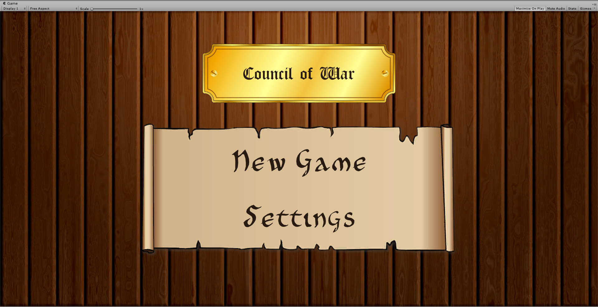
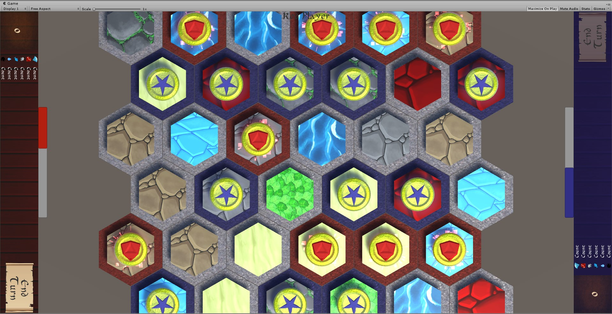
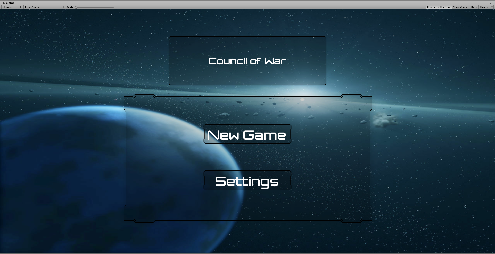
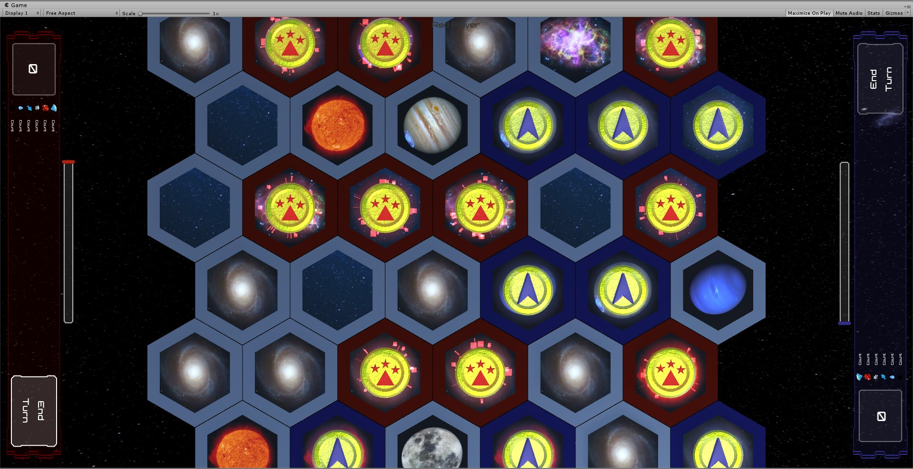

<html>
    <body>
        

            <h2>War Council</h2>
            

                War Council is a turned based strategy game in which two factions fight for dominance and try to overwhelm their opponent.
                 
                Each tile generates tickets and the player to first accumulate enough tickets will win the game.
                Some tiles feature special interactions such as generating resources or allowing the player to recruit   units or create spells.
                 
                Units are required to capture or defend tiles. Spells on the other hand are used to give the caster an advantage or put his opponent at an disadvantage. Some of these spells allow to block tiles for some amount of time or to grant extra movement to units.
                 
                All interactions are done via touch, such as drag and drop for units or multitap and pinch for spells.
                  
                This project was almost entirely made by myself aside from some assistance for minor tasks.
            

            

                
                
                 
                
                
            

        

    </body>
</html>